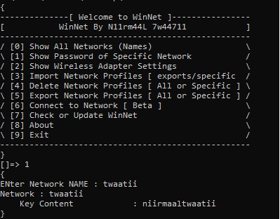

# WinNet
Network Tool For Windows OS ; View Wi-Fi Passwords , DELETE or Import/Export Wi-Fi Networks etc ;

## Screenshots


## SetUp
```
$ git clone https://github.com/niirmaaltwaatii/WinNet
```
```
$ cd WinNet
```
```
$ WinNet OR winnet.bat | ./winnet OR ./winnet.bat
```

## Warnings
* Wi-Fi Networks Delete
  - Be careful while deleting all networks , No Turning Back
  - Choosing Wi-Fi name * in specific delete is same as delete all so never enter *
  - AndroidShare* deletes all networks starting from AndroidShare eg. AndroidShare_4569
* Export Networks
  - Exporting networks that is already on exports/ overwrites it

### Known bugs & errors
* Network Connect doesn't work
* Network Pofiles Import from exports/ gives error
